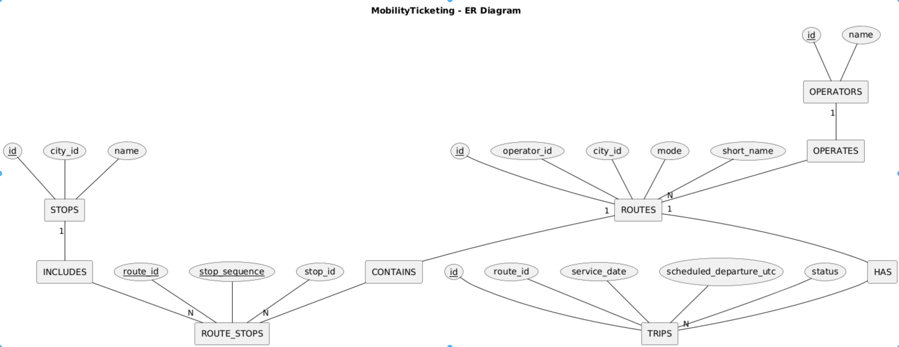

# Lecture 1 dossier

## System context

MobilityTicketing sits between transport operators and the people who ride
with them. An operator runs routes in a city: a route has a mode (metro,
bus, and so on), a set of stops in order, and scheduled trips on specific
dates. A customer picks a route, buys a ticket for a specific trip, and
validates that ticket when they board. The job of the data model is to
keep this whole loop consistent: which trips exist and when they run,
which tickets belong to which trip and customer, what was actually paid,
and whether a ticket was used.

There is no single "MobilityTicketing app." Several pieces read and write
the same data: a route-planning tool used by operators, a customer-facing
app for buying and validating tickets, a payment gateway that confirms
captured payments, and internal reporting that shows how much money came
in per operator per day. None of these are named as specific products on
purpose. The point of a system context is what the data has to support,
not which tools happen to implement it.

## Access-pattern map

- **Route search.** A customer or the route-planning tool looks up which
  stops belong to a route, in order, and which trips are coming up for a
  route after a given time. Read-only, needs to be fast, and has to
  include routes with zero trips rather than silently dropping them.

- **Ticket purchase.** A customer buys a ticket for a specific trip and
  product (single ride, day pass, etc). This writes a ticket row tied to
  the customer, the trip, and the product, at the price and currency that
  applied at that moment, plus a payment row recording whether the charge
  went through. The ticket has to keep the price the customer actually
  paid, even if the product's catalogue price changes later.

- **Ticket validation.** A customer taps their ticket when boarding. This
  writes a validation row tied to that exact ticket, matched on both the
  ticket id and the ticket code, so a validation can't quietly attach
  itself to the wrong ticket if the two ever drift apart. A ticket can be
  validated more than once on a longer trip, so this is always an insert,
  never an update.

- **Timetable updates.** An operator adds new trips, changes a trip's
  status (delayed, cancelled), or updates route and stop details. This has
  to happen without breaking tickets or validations that already point at
  the older data, which is also why deletes on routes, stops and trips are
  restricted rather than cascaded: removing a stop or a trip should not
  quietly take a paid ticket's history down with it.

- **Real-time availability.** Before or during boarding, something needs
  to check how full a trip is: how many seats it has against how many are
  already reserved. This has to stay correct even when two purchases
  happen close together in time, which is one of the places this project's
  own documentation admits a plain constraint cannot fully solve on its
  own.

- **Reporting.** An operator or finance wants to know how much captured
  revenue came in per operator per day. This gets read far less often than
  tickets get bought, but the read can get expensive if it is computed
  from scratch every time. That is exactly why this project later compared
  a direct query, a SQL function, a trigger-maintained table and a
  materialized view against each other, and settled on the materialized
  view as the better fit for something that can tolerate some delay.

## Route-stop primary key

Key: `(route_id, stop_id)`.

A route-stop row records that a route calls at a stop, and where in the
sequence. In this slice a route calls at any stop at most once, so the
`(route_id, stop_id)` pair already identifies the row. `stop_sequence` is an
attribute of that pair, constrained unique per route so the ordering has no
gaps in meaning or ties.

A stop may **not** occur more than once on the same route under this key. Real
loop routes and out-and-back services do revisit a stop; supporting them means
moving the key to `(route_id, stop_sequence)` and letting `stop_id` repeat.

## ER diagram

Chen notation. Entities: `OPERATORS`, `ROUTES`, `STOPS`, `TRIPS`, and the
associative entity `ROUTE_STOPS` (via the `INCLUDES`/`CONTAINS`
relationships, modelling the routes*..*stops many-to-many). Relationships:
`OPERATES` (operator 1 -- N routes), `HAS` (route 1 -- N trips), `INCLUDES`
(stop 1 -- N route_stops), `CONTAINS` (route 1 -- N route_stops).
Identifiers (`id`) are underlined on every entity that has one.

## SQL model vs. ER diagram

- Entities match: operators, routes, stops, route_stops (associative), trips.
- Cardinalities match: operator 1..* routes; route *..* stops via route_stops;
  route 1..* trips.
- Difference: the ER diagram leaves the route-stop identity implicit ("a stop
  on a route"). The SQL model makes it explicit as `(route_id, stop_id)` and
  thereby encodes the "at most once" assumption that the diagram did not state.
- `city_id` on routes and stops is a plain text attribute here, not a foreign
  key to a `cities` entity that the diagram implies. No `cities` table exists
  in this slice.

## One functional dependency

`stop_id -> city_id, name` in `stops`: a stop determines its city and name.
`route_id -> operator_id, city_id, mode, short_name` in `routes` likewise.

In `route_stops`, `(route_id, stop_id) -> stop_sequence` and
`(route_id, stop_sequence) -> stop_id`. There is no dependency from part of the
key alone, so the table is already normalized; storing `stop.name` or
`route.short_name` in `route_stops` would introduce a partial dependency and
allow the same stop to carry two different names. Normalization prevents that
update anomaly.

## Assumption that may change later

A route visits each stop at most once. Loop lines (for example an airport
circulator) and out-and-back branches break this, and would force the
route-stop key to `(route_id, stop_sequence)`. Direction of travel is also
folded into a single route today; splitting inbound/outbound into separate
routes or adding a `direction` column is the likely next change.
